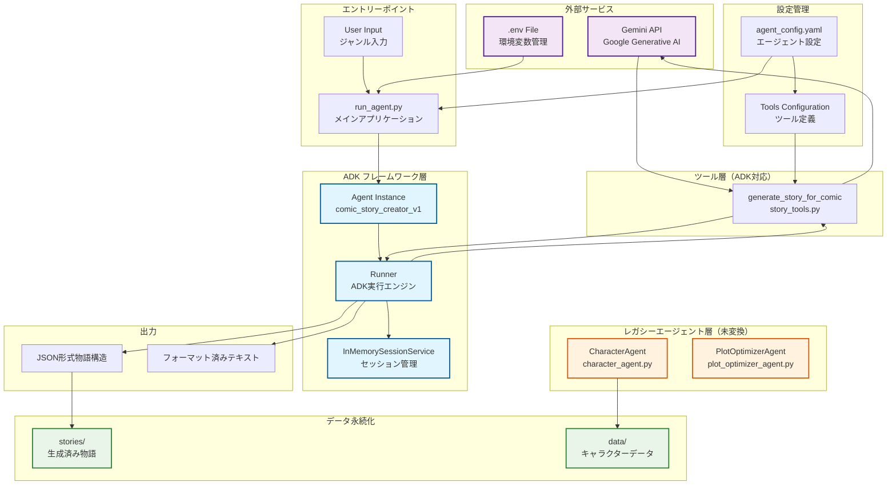
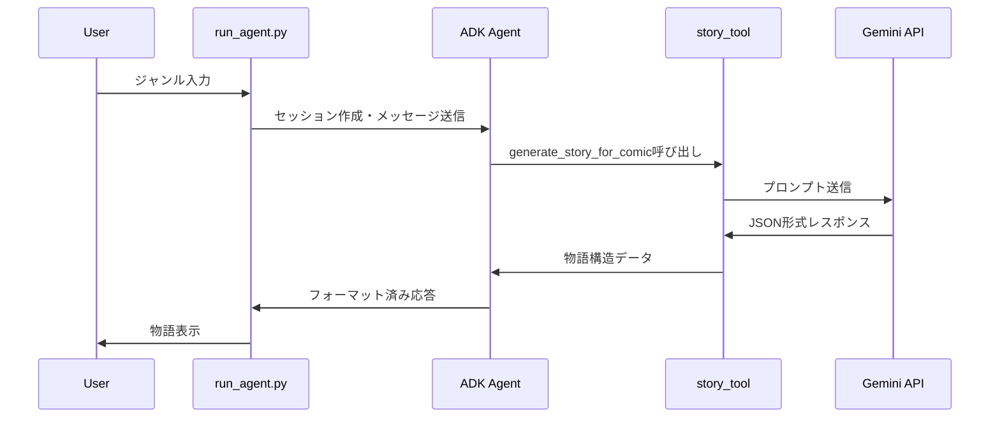

# Comic Agent アプリケーション ブロック図

## システム概要
Comic Agentは、ADK（Agent Development Kit）フレームワークを使用した漫画ストーリー生成システムです。



## 詳細コンポーネント説明

### 1. メインアプリケーション（run_agent.py）
- **役割**: システムのエントリーポイント
- **機能**:
  - 環境変数（.env）からGEMINI_API_KEYを読み込み
  - ADKフレームワークの初期化
  - ユーザー入力の処理
  - エージェントとの会話セッション管理

### 2. ADK フレームワーク層
#### Agent Instance (comic_story_creator_v1)
- **役割**: メインの物語生成エージェント
- **設定**: agent_config.yaml内のadk_agentsセクション
- **使用ツール**: generate_story_for_comic

#### Runner
- **役割**: ADKエージェントの実行エンジン
- **機能**: 非同期メッセージ処理、ツール呼び出し管理

#### SessionService
- **役割**: ユーザーセッションの管理
- **実装**: InMemorySessionService（メモリ内管理）

### 3. ツール層
#### generate_story_for_comic (story_tools.py)
- **役割**: 物語構造生成のADK対応ツール
- **入力**: genre, llm_model_name, temperature, max_tokens
- **出力**: JSON形式の物語構造（title, characters, plot, themes）
- **API**: Gemini API経由でLLM呼び出し

### 4. レガシーエージェント層（要変換）
#### CharacterAgent
- **役割**: キャラクター管理
- **状態**: クラスベース（ADK未対応）
- **データ**: characters.json形式で永続化

#### PlotOptimizerAgent  
- **役割**: プロット分析・改善提案
- **状態**: クラスベース（ADK未対応）
- **機能**: Gemini APIでプロット改善案生成

### 5. 設定管理
#### agent_config.yaml
```yaml
adk_agents:           # ADK対応エージェント
  comic_story_creator_v1: ...
agents:               # レガシーエージェント
  - character_agent_v1: ...
  - plot_optimizer_agent_v1: ...
tools:                # LLMツール設定
  - llm_tool_gemini_pro: ...
```

### 6. データフロー



## システムの特徴

### ✅ ADK移行済み部分
- 物語生成機能（comic_story_creator_v1）
- ツール化された story_tools.py
- 非同期実行基盤

### 🔄 ADK移行待ち部分  
- キャラクター管理（CharacterAgent）
- プロット最適化（PlotOptimizerAgent）

### 🔒 セキュリティ
- 環境変数による API キー管理
- .env ファイルでの安全な秘密情報保存

### 📊 出力形式
- JSON構造化データ
- 人間読み取り可能なフォーマット済みテキスト
- ファイルベース永続化

## 技術スタック
- **フレームワーク**: Google ADK (Agent Development Kit)
- **LLM**: Gemini API (gemini-1.5-flash)
- **言語**: Python 3.x
- **非同期**: asyncio
- **設定**: YAML
- **データ**: JSON
- **環境管理**: python-dotenv
